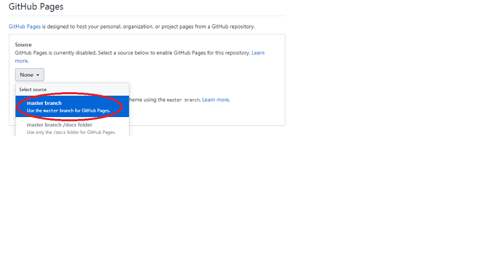

# ЗВІТ
1. Щоб репозиторій мав вигляд сайту у мережі треба або задати наступне ім'я репозиторію — нікнейм.github.io

або, якщо вам потрібно зробити сторінку із вже існуючого репозиторію треба зайти у Settings

та натиснути Master Branch

2. Для того щоб завантажити файли до репозиторію потрібно натиснути на Upload Files

Choose your files

